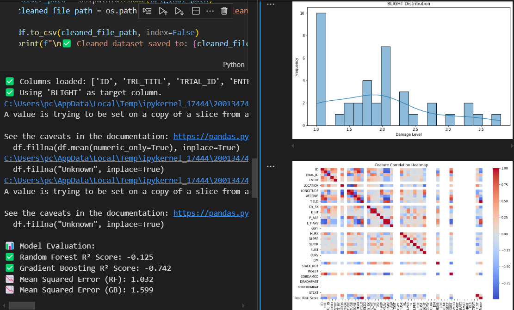
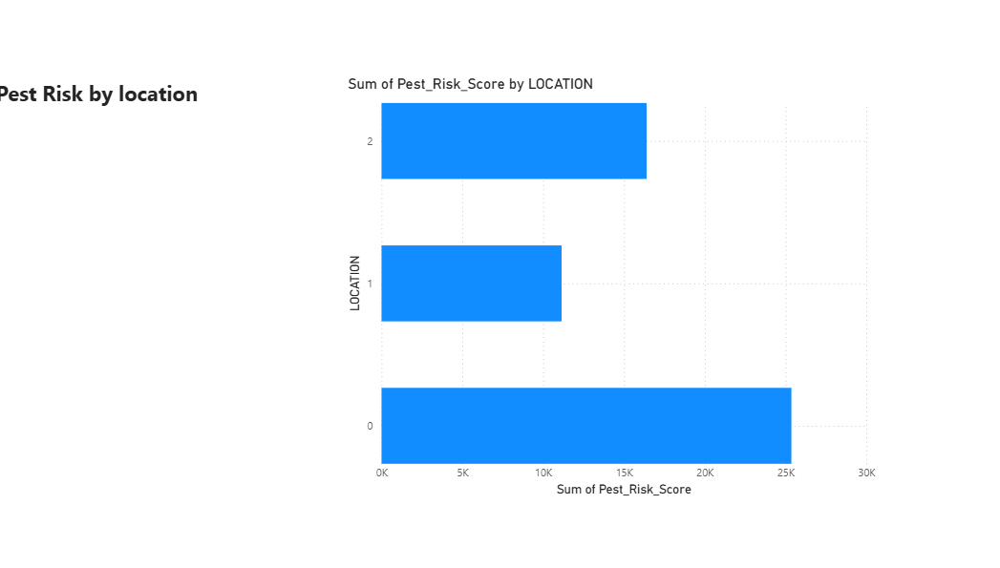

 # Agriculture Pest Control Analytics

Name: Uwase Tracy 27105  
Course: INSY 8413 | Introduction to Big Data Analytics  
Institution: Adventist University of Central Africa (AUCA)

##  Table of Contents
- [Project Overview](#-project-overview)
- [Problem Statement](#-problem-statement)
- [Dataset Information](#-dataset-information)
- [Project Structure](#-project-structure)
- [Analysis Workflow](#-analysis-workflow)
- [Key Findings](#-key-findings)
- [Technologies Used](#️-technologies-used)
- [Python Analytics Tasks](#-part-2-python-analytics-tasks)
- [Power BI Dashboard Tasks](#-part-3-power-bi-dashboard-tasks)
- [Innovation Elements](#innovation-elements)
- [License](#-license)

##  Project Overview
This capstone project focuses on **Agriculture Pest Control Analytics** using maize trial data from Zambia. The project aims to analyze pest patterns, predict crop yields, and provide insights for better agricultural management.

##  Problem Statement
**"Can we predict crop yield and identify pest patterns in maize cultivation using historical trial data to improve agricultural productivity and pest management strategies?"**

##  Dataset Information
- **Dataset Title**: International Maize Trial Regular Zambia
- **Source**: Agricultural research trials in Zambia
- **Structure**: 45 rows × 47 columns (Structured CSV)
- **Data Status**: Requires preprocessing (missing values, inconsistent formats)
- **Key Variables**: Yield, pest indicators (RUST, BLIGHT, CURV, etc.), environmental factors

##  Project Structure
```
PEST-CONTROL-CAPSTONE/
│
├── data/
│   ├── cleaned_maize_data.csv
│   └── international_maize_trial_regular_zambia.csv
│
├── images/
│   └── image.png
│
├── notebooks/
│   └── pest_control_analysis.ipynb
│
├── powerbi/
│   └── pest_dashboard.pbix
│
├── presentation/
│
└── README.md
```

## 🔍 Analysis Workflow
### 1. Data Exploration (`pest_control_analysis.ipynb`)
- Track and measure pest incidence across different trial locations.
- Identify pest impact on maize yield and recommend interventions.
- Develop predictive models to forecast pest risk levels and expected yields.
- Provide visual dashboards (via Power BI) to help farmers, agronomists, and policymakers make informed pest management decisions.

### Dashboard Components:
- **Yield Analysis**: Trends and predictions
- **Pest Patterns**: Geographic and temporal analysis
- **Environmental Factors**: Impact on crop health
- **Interactive Filters**: Location, year, variety selection

##  Key Findings
### Pest Patterns
- **Rust** and **Blight** are the most common pests affecting maize.
- Geographic variations in pest prevalence.
- Seasonal patterns in pest outbreaks.

### Yield Factors
- **Plant Height** and **Ear Height** strongly correlate with yield.
- **Environmental Zone** significantly impacts productivity.
- **Variety Selection** crucial for pest resistance.

### Predictive Insights
- Machine learning models achieve good accuracy in yield prediction.
- Pest presence can reduce yield by 20-40%.
- Location-specific recommendations improve outcomes.

##  Technologies Used
- **Python**: pandas, numpy, scikit-learn, matplotlib, seaborn
- **Jupyter Notebook**: Interactive analysis and documentation
- **Power BI**: Data visualization and dashboard creation
- **Git**: Version control and collaboration

##  PART 2: Python Analytics Tasks
- Clean the Dataset: Missing values, outliers, transformations
- Conduct EDA: Descriptive statistics, visualizations
- Apply ML Models: Regression and classification
- Evaluate Models: Accuracy, precision, RMSE metrics
- Structure Code: Modular functions, clear documentation
- Innovation: Custom pest index, ensemble methods




## PART 3: Power BI Dashboard Tasks
-  Communicate Problem & Insights: Clear context and summaries
-  Incorporate Interactivity: Slicers, filters, drill-down options
-  Use Appropriate Visuals: Charts matched to data goals
-  Ensure Design Clarity: Consistent themes, clear labels
-  Add Innovative Features: DAX formulas, custom tooltips





##  Innovation Elements
1. **Custom Pest Index**: Combined pest severity scoring


##  License
This project is for academic purposes. Please cite appropriately if using the methodology or findings.
